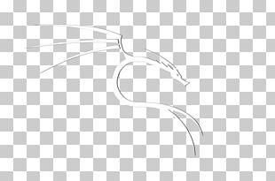

<div id="top"></div>

<!-- PROJECT SHIELDS -->

[![Issues][issues-shield]][issues-url]
[![MIT License][license-shield]][license-url]


<!-- PROJECT LOGO -->
<br />
<div align="center">
  <a href="https://github.com/t1gr3/setup-kali-i3">
    
  </a>

  <h3 align="center">SETUP KALI I3</h3>

  <p align="center">
    An i3 installation on Kali linux
    <br />
    <a href="https://github.com/t1gr3/setup-kali-i3"><strong>Explore the docs »</strong></a>
    <br />
    <br />
    <a href="https://github.com/t1gr3/setup-kali-i3">View Demo</a>
  </p>
</div>


<!-- ABOUT THE PROJECT -->
## About The Project

[![Product Name Screen Shot][product-screenshot]](https://github.com/t1gr3/setup-kali-i3)

This project is created to transform the Kali Linux interface using I3 and make my life easier, since I usually just stick to the terminal to do my tasks.

Here's why:
* I like the terminal better than having just a graphical environment.
* I find it has a clean look and feel and you only invoke what you need.
* Finally I like the way it looks :smile:

Use the `BLANK_README.md` to get started.

<p align="right">(<a href="#top">back to top</a>)</p>


### Built With

This section should list any major frameworks/libraries used to bootstrap your project. Leave any add-ons/plugins for the acknowledgements section. Here are a few examples.

* [Bash](https://www.gnu.org/software/bash/)
* [Python](https://www.python.org/)
* [Linux](https://www.linux.org/)
* [Rofi](https://github.com/davatorium/rofi)

<p align="right">(<a href="#top">back to top</a>)</p>


<!-- GETTING STARTED -->
### Prerequisites

Have Kali Linux installed.

### Installation

_Below you will find the steps required to do the installation within our environment._

1. Update Kali
2. Clone the repo
   ```sh
   git clone https://github.com/t1gr3/setup-kali-i3.git
   ```
3. Give execution permissions to Setup
   ```sh
   chmod +x setup.sh
   ```
4. Executor the script `setup.sh`
   ```sh
   ./setup.sh
   ```

<p align="right">(<a href="#top">back to top</a>)</p>


<!-- LICENSE -->
## License

Distributed under the MIT License. See `LICENSE.txt` for more information.

<p align="right">(<a href="#top">back to top</a>)</p>


<!-- CONTACT -->
## Contact

Your Name - [@t1gr385](https://twitter.com/t1gr385)

Project Link: [https://github.com/t1gr3/setup-kali-i3](https://github.com/t1gr3/setup-kali-i3)

<p align="right">(<a href="#top">back to top</a>)</p>


<!-- MARKDOWN LINKS & IMAGES -->
[issues-shield]: https://img.shields.io/github/issues/t1gr3/setup-kali-i3?style=for-the-badge
[issues-url]: https://github.com/t1gr3/setup-kali-i3/issues
[license-shield]: https://img.shields.io/github/license/t1gr3/setup-kali-i3?style=for-the-badge
[license-url]: https://github.com/t1gr3/setup-kali-i3/LICENSE.txt
[product-screenshot]: images/screenshot.png
